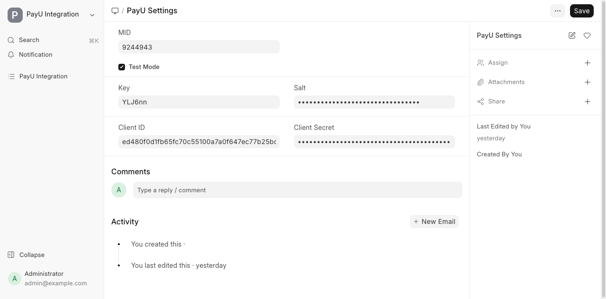
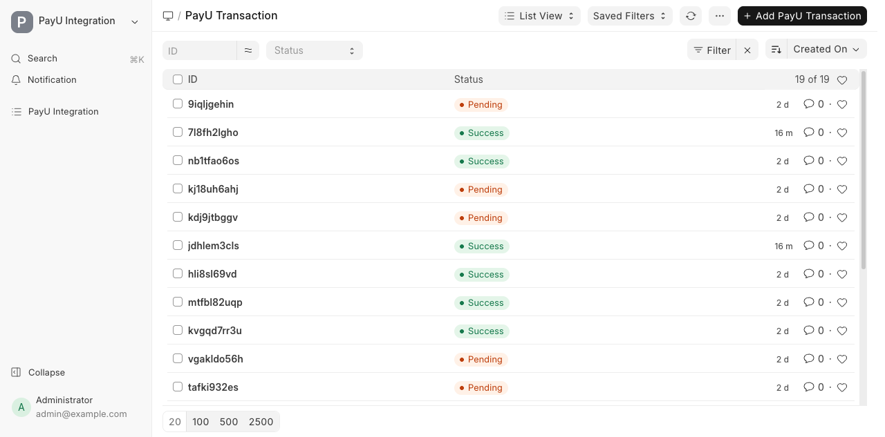
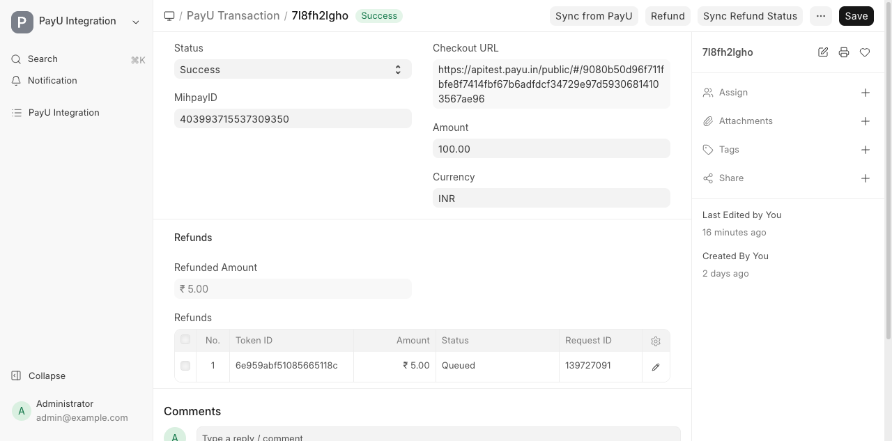
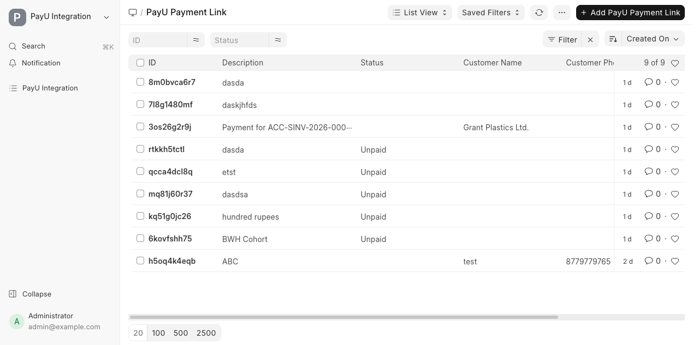
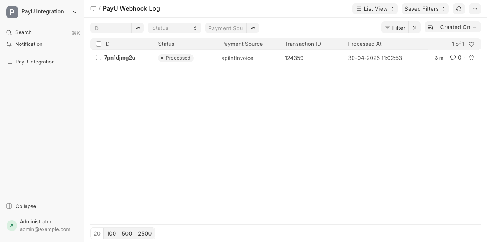
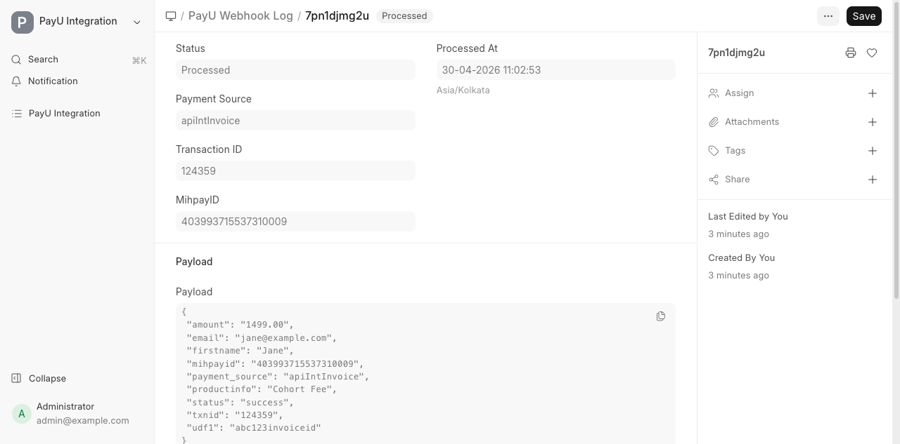
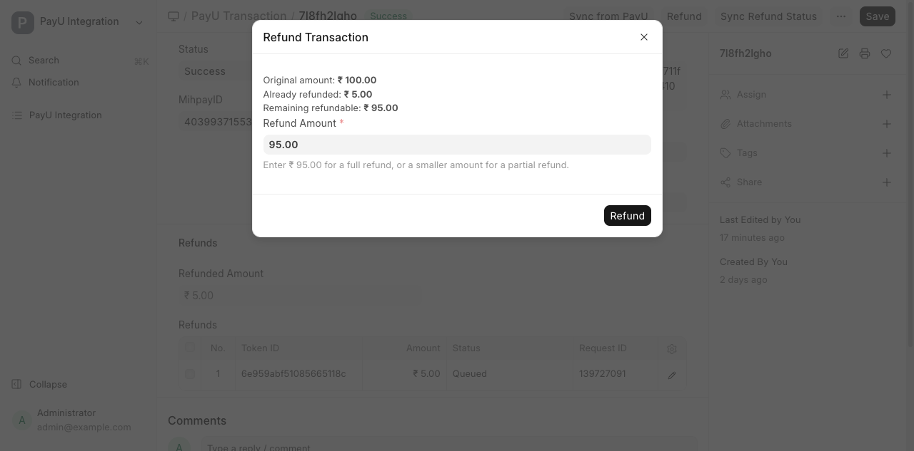

# PayU Integration

A Frappe app that connects [PayU India](https://payu.in/) to your bench — capture payments via hosted checkout, share Payment Links with customers, log signed webhooks, and issue refunds, all from the desk.

> This integration was built during the [BuildWithHussain.com/school integrations training](https://buildwithhussain.com/school) — a hands-on cohort that teaches building production-grade Frappe integrations end-to-end.

---

## Contents

- [Getting Started](#getting-started)
- [Configuring Settings](#configuring-settings)
- [Features](#features)
  - [PayU Settings](#payu-settings)
  - [PayU Transaction (hosted checkout)](#payu-transaction-hosted-checkout)
  - [PayU Payment Link](#payu-payment-link)
  - [PayU Webhook Log](#payu-webhook-log)
  - [Refunds](#refunds)
- [Code Examples](#code-examples)
- [Webhook URL & Security](#webhook-url--security)
- [PayU Documentation Reference](#payu-documentation-reference)

---

## Getting Started

### 1. Install the app

```bash
cd $PATH_TO_YOUR_BENCH
bench get-app https://github.com/BuildWithHussain/payu_frappe --branch develop
bench --site <your-site> install-app payu
```

### 2. Get PayU credentials

You need a PayU India merchant account. Sign up at [payu.in](https://payu.in/), then collect:

| Field         | Where to find it                                                                                   |
| ------------- | -------------------------------------------------------------------------------------------------- |
| **MID**       | PayU Dashboard → *Settings → Profile* (Merchant ID)                                                |
| **Key**       | PayU Dashboard → *Settings → My Account → API Configuration*                                       |
| **Salt**      | Same screen as Key. Salt v2 (SHA-512) is what this app uses.                                       |
| **Client ID** | PayU OAuth credentials — *Settings → API Configuration → OAuth* (used for Payment Links).         |
| **Client Secret** | Same screen as Client ID.                                                                      |

For sandbox testing, request **test credentials** from PayU support — they hand out a separate test MID/Key/Salt that hits the UAT environment. The "Test Mode" toggle in PayU Settings switches all API calls to PayU's UAT endpoints (`apitest.payu.in`, `uatoneapi.payu.in`, `test.payu.in`).

---

## Configuring Settings

Open the desk → **PayU Settings** and fill in the credentials from above. Tick *Test Mode* while you're in development.



Salt and Client Secret are stored encrypted via Frappe's password manager.

---

## Features

### PayU Settings

A single-doc settings page. Holds the credentials and the *Test Mode* toggle that routes all outgoing API calls between PayU's UAT and live endpoints.

### PayU Transaction (hosted checkout)

Each row represents a hosted-checkout payment kicked off from your site. Created when you call `initiate_checkout` — the app gets back a `checkoutUrl` and saves it on the doc, so the customer can be redirected to PayU.

The form keeps the `mihpayid` (PayU's internal payment id), the local status (Pending / Success / Failure / Cancelled), the amount and currency, and a child table of refunds against the transaction.





Buttons on the form:
- **Sync from PayU** — re-queries the v3 transaction API and updates the local status / mihpayid.
- **Refund** — opens the refund dialog (only shown when status is `Success`, mihpayid exists, and refundable balance > 0).
- **Sync Refund Status** — polls PayU for any refund rows currently in `Queued` and updates them.

### PayU Payment Link

Stand-alone payment links you share with customers (e.g. via email/SMS). On `before_insert` the app calls PayU's `payment-links` API and stores the returned URL. Webhooks update the link's status to `Paid` once the customer pays.



### PayU Webhook Log

Every webhook hit from PayU lands here. The flow:

1. **Verify signature** — the request's `hash` is recomputed with your Salt using PayU's reverse-hash formula (`sha512(SALT|status||||||udf5|udf4|udf3|udf2|udf1|email|firstname|productinfo|amount|txnid|key)`). Tampered or unsigned payloads return `401`.
2. **Persist** — the full payload is stored as a `PayU Webhook Log` row with `status=Pending`.
3. **Enqueue** — processing happens in a background RQ job (`short` queue) so PayU gets a fast `200`.
4. **Update** — on success the row flips to `Processed` with a `processed_at` timestamp; on failure it flips to `Failed` with the traceback in the `error` field.





A **Reprocess** button on Failed (and Pending) rows re-enqueues the job — useful when a downstream doctype was missing the first time around.

### Refunds

The Refund button on a successful transaction opens this dialog:



It shows the original amount, what's already been refunded, and the remaining refundable balance. You can issue a full or partial refund. The app:

- Generates a `token_id` (idempotency key for PayU)
- Hashes `key|cancel_refund_transaction|mihpayid|salt` (PayU's postservice hash format)
- POSTs to PayU's refund endpoint
- Adds a row to the `Refunds` child table with `Queued` status and the `request_id`

Click **Sync Refund Status** later to pull the final state (`Success` / `Failed`) from PayU's `check_action_status` API.

---

## Code Examples

### Initiate a hosted-checkout transaction

The `initiate_checkout` whitelisted method creates a `PayU Transaction` record, calls PayU's v2 payments API, and returns a `checkout_url` you redirect the customer to.

**From Python (server-side):**

```python
import frappe

result = frappe.call(
    "payu.api.initiate_checkout",
    product_name="cohort-fee",  # a Website Item with a price
    qty=1,
)
# result == {"checkout_url": "https://apitest.payu.in/public/#/..."}
```

**From the browser (client-side):**

```javascript
frappe.call({
    method: "payu.api.initiate_checkout",
    args: { product_name: "cohort-fee", qty: 1 },
}).then((r) => {
    window.location.href = r.message.checkout_url;
});
```

### Create a Payment Link from script

```python
import frappe

link = frappe.get_doc({
    "doctype": "PayU Payment Link",
    "description": "Cohort Fee — May batch",
    "amount": 1499,
    "customer_name": "Jane Doe",
    "customer_email": "jane@example.com",
    "customer_phone": "9876543210",
}).insert()

print(link.url)  # https://pay.payu.in/...
```

### Issue a refund programmatically

```python
txn = frappe.get_doc("PayU Transaction", "7l8fh2lgho")
txn.refund(amount=500)  # partial refund of ₹500

# Later, pull the latest status from PayU:
txn.sync_refund_statuses()
```

The `refund` method validates that the transaction is `Success`, has a `mihpayid`, and that the requested amount fits within the remaining refundable balance — it raises a clear `frappe.throw` otherwise.

---

## Webhook URL & Security

Configure this URL in your PayU dashboard's webhook settings:

```
https://<your-site>/api/method/payu.api.webhook
```

The endpoint:
- Verifies the SHA-512 reverse hash against your Salt before doing anything else
- Rejects with `frappe.AuthenticationError` if the hash is missing or wrong
- Logs every accepted hit to **PayU Webhook Log** for auditability

Never expose your Salt or Client Secret in client-side code.

---

## PayU Documentation Reference

| Topic                                  | Link                                                                                          |
| -------------------------------------- | --------------------------------------------------------------------------------------------- |
| API overview                           | https://docs.payu.in/                                                                         |
| Webhooks                               | https://docs.payu.in/docs/webhooks                                                            |
| Hash request & response                | https://docs.payu.in/docs/hashing-request-and-response                                        |
| Generate hash (merchant hosted)        | https://docs.payu.in/docs/generate-hash-merchant-hosted                                       |
| Server-to-server (v2/v3) integration   | https://docs.payu.in/docs/integrate-with-s2s                                                  |
| Payment Links API                      | https://docs.payu.in/docs/create-payment-link                                                 |
| Refunds (postservice)                  | https://docs.payu.in/docs/refund-transaction-api                                              |
| OAuth tokens                           | https://docs.payu.in/docs/get-oauth-token                                                     |

---

## Contributing

Pre-commit (ruff, eslint, prettier, pyupgrade):

```bash
cd apps/payu
pre-commit install
```

## License

MIT
